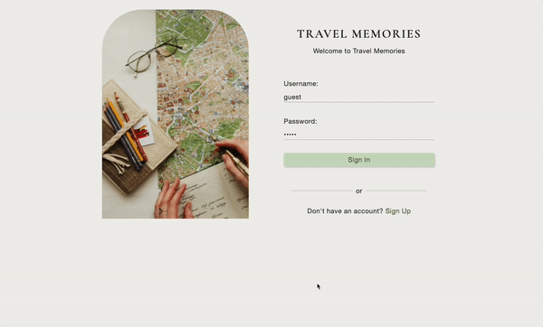

# Hi there, I'm Hien 👋

<!--
**hnguy96/hnguy96** is a ✨ _special_ ✨ repository because its `README.md` (this file) appears on your GitHub profile.

Here are some ideas to get you started:

- 🔭 I’m currently working on ...
- 🌱 I’m currently learning ...
- 👯 I’m looking to collaborate on ...
- 🤔 I’m looking for help with ...
- 💬 Ask me about ...
- 📫 How to reach me: ...
- 😄 Pronouns: ...
- ⚡ Fun fact: ...
-->

I'm a Web Developer based in Southern California. I have a passion for developing accessible, user-friendly websites that engage users through responsive design and creative flairs.

When I'm not coding, you can find me exploring nature or working on my jewelry brand, Lucky Dreamer.

## Projects
### Travel Memories
🚧 Currently working on User Authentication 🚧

A full-stack application for people who love to travel and document their memories. This travel diary not only captures your experiences, but also enables you to plot where you've traveled to on a map!  

[View Live](https://travel-memories-journal.herokuapp.com/) | [Source Code](https://github.com/hnguy96/travel-memories)

  

  

### What's Cooking?
A dynamic HTML, CSS, and JavaScript application that allows users to take a quiz and generate a custom recipe.  

[View Live](https://hnguy96.github.io/whats-cooking/) | [Source Code](https://github.com/hnguy96/whats-cooking)

  

  

## Skills

  

## Connect With Me
- [Portfolio](https://www.hellohien.com/)  
- [Linkedin](https://www.linkedin.com/in/hnguy96/)  
- [Resume](https://drive.google.com/file/d/1UmjrtGYexI7IqGa3xsEq336soWEHV3dU/view)  
- [Email](mailto:contact@hellohien.com)  
